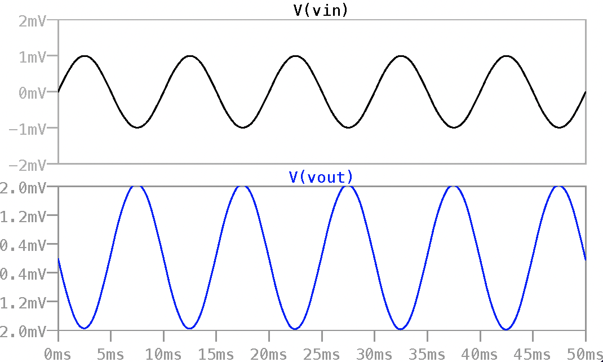

# Common Source Amplifier Simulation in LTSpice
This repository contains the LTSpice simulation files for a Common Source Amplifier. This project is my attempt to better understand the properties and working of the CS stage, and to gain experience in SPICE based analog electronic simulator software.

## Table of Contents:
1. [ Introduction ](#intro)
2. [ Features](#features)
3. [Simulation Parameters](#sp)
4. [Results](#rs)

### 1. Introduction

sometext

### 2. Features

sometext

### 3. Simultaion Parameters

sometext

### 4. Results
#### Schematic

#### Waveforms

sometext

